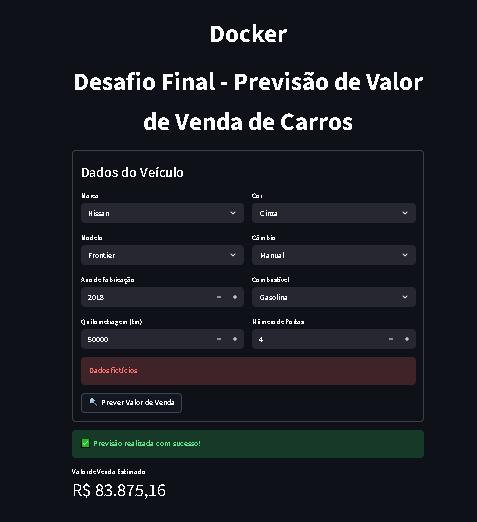
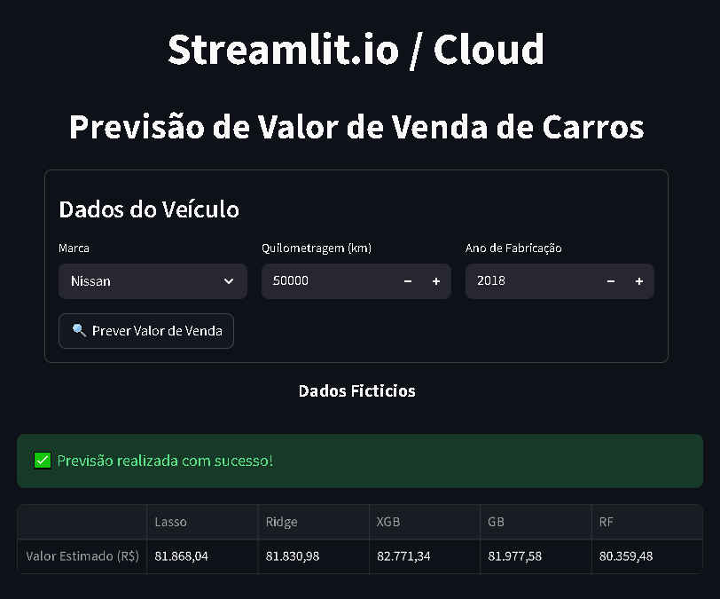

<p align="center">
  
  
</p>

# Projeto Acadêmico de Previsão de Preços de Carro

Este projeto visa prever o preço de carros com base em diversas características. A previsão é realizada usando técnicas de aprendizado de máquina, onde foi construido um modelo preditivo treinado em um conjunto de dados relevante.

## Características do Projeto
- **Modelo:** Utiliza algoritmos de aprendizado de máquina como regressão linear, árvore de decisão, entre outros.
- **Dados:** Dados que incluem características dos carros como ano, modelo, quilometragem, e muito mais.
- **Resultados:** O modelo fornece previsões de preços com métricas de desempenho como MAE, RMSE.

## Desenvolvimento

### Análise Exploratória

A primeira etapa desse projeto foi a análise exploratória dos dados, onde identificou a existência de dados ausentes, dados com valores extremos (outliers) e dados indevidos com a coluna onde foi encontrado. Nessa análise foram identificados padrões de valores de venda em função das colunas de dados existentes.

### Modelagem

Ao final da etapa de análise,  o dataset gerado foi salvo e se iniciou a etapa de modelagem.
Nessa etapa os dados foram tratados para o modelo possa realizar o treinamento e a avaliação seja feita.
Foram treinados e avaliados 7 modelos de reggressão.
Foram geradas 4 métricas e mais duas colunas com informações geradas durante o treinamento.
Um dataset com todos treinamentos, métricas e dados gerados é apresentado no final.
O GridSearch foi aplicado ao melhor modelo para identificar os melhores hiperparametros.

#### Deploy

Foi implementada uma aplicação web com a lib Streamlit. 

A aplicação esta hospedada no site streamlit.io.

Acesso: [🔗 Desafio Final Previsao de Valor de Carro](https://desafiofinal.streamlit.app/)

#### Docker

A mesma aplicação pode ser executada localmente na linha do terminal através do streamlit ou através do docker que foi implementado. Para sua execução é preciso ter o Docker Desktop instalado no seu ambiente.

Esta implementação fez  uso da lib FastAPI, onde um servidor espera requisitos POST na porta 8000 e devolve os valores previstos para os dados obtidos numa interface web do Streamlit.

  
## Estrutura do Projeto

#### Estrutura de Diretórios

```

├── app_api
│   ├── [configuração FastAPI no Docker]
├── app_streamlit
│   ├── [configuração da interface web do Streamlit no Docker]
├── dados
│   ├── [Datasets usados]
├── imgs
│   ├─ [Imagens salvas no EDA e imagens usadas no Streamlit]
├── modelo
│   ├── [modelos de machine treinados]
├── notebook
│   ├── [notebooks usados na Analise Exploratória e na modelagem dos modelos]

```

## Descrições das Pastas

- **app_api**: [FastAPI / Docker]
- **app_streamlit**: [Streamlit / Docker]
- **dados**: [Datasets]
- **imgs**: [Imagens da Análise Exploratória e do Streamlit]
- **modelo**: [Modelos de machine treinados]
- **notebook**: [Notebooks da Análise Exploratória e da modelagem dos modelos]

## Instruções de Configuração

1. Clone o repositório:
   ```bash
   git clone <URL do seu repositório>
   ```

2. Navegue até o diretório do projeto:
   ```bash
   cd <nome do diretório>
   ```

3. Construa os contêineres do Docker:
   ```bash
   docker-compose up --build
   ```

4. Execute a aplicação:
   ```bash
   docker-compose start
   ```

5. Acesse a aplicação em seu navegador:
   ```bash
   http://localhost:<porta>
   ```
6. Execute localmente o app.py do streamlit:
```bash
streamlit run app.py
```   
7. Ou acesse o app ja implementado na cloud do Streamlit.io:
[🔗 Desafio Final Previsao de Valor de Carro](https://desafiofinal.streamlit.app/) 

